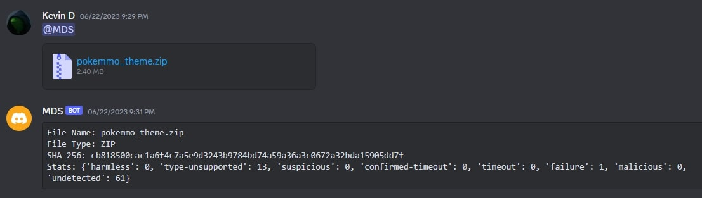

# Malware Detection System - Discord Bot
 
## Purpose

Discord Bot that allows users to scan hyperlinks and files to detect malware via the text channels

## Installation

You can invite the bot to your discord server here: [Bot Invite Link](https://discord.com/api/oauth2/authorize?client_id=1120553994553663488&permissions=274877908992&scope=bot)

## Usage

**@MDS [Hyperlink]**
**@MDS [File Attachment]**

## Example

